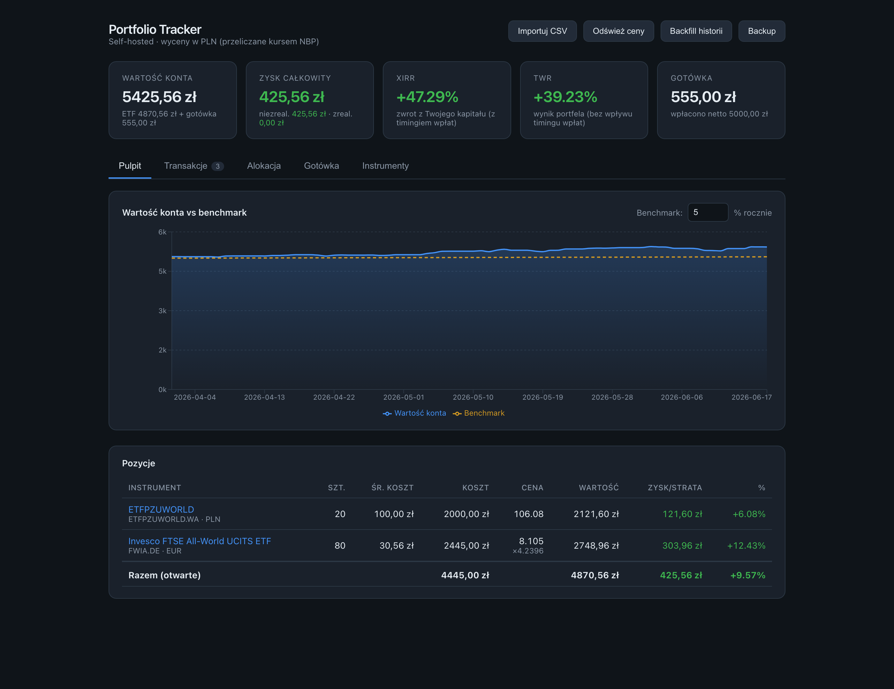
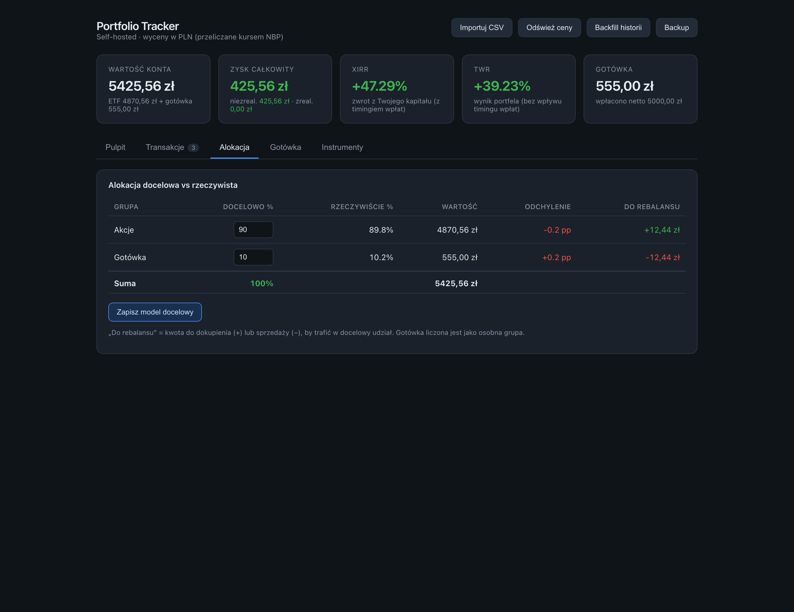
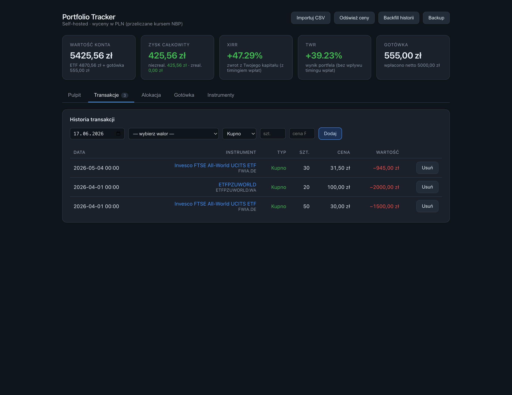

# Portfolio Tracker

[](https://hub.docker.com/r/kpa90/portfolio-tracker)

Self-hostowany tracker portfela ETF-ów dla inwestora kupującego przez polskie biuro
maklerskie (np. konto IKE). Importuje historię transakcji z CSV, pobiera bieżące wyceny,
przelicza waluty kursem NBP i pokazuje wartość, zysk/stratę (zrealizowany + niezrealizowany),
stopę zwrotu oraz porównanie z benchmarkiem — **wszystko w PLN**.

## Zrzuty ekranu

> Dane na zrzutach są przykładowe (fikcyjne), wygenerowane na potrzeby dokumentacji.

| Pulpit | Alokacja | Transakcje |
|---|---|---|
|  |  |  |

---

## Spis treści

- [Funkcje](#funkcje)
- [Kluczowe koncepcje](#kluczowe-koncepcje)
- [Stack technologiczny](#stack-technologiczny)
- [Uruchomienie](#uruchomienie)
- [Konfiguracja](#konfiguracja)
- [Sposób użycia](#sposób-użycia)
- [Architektura](#architektura)
- [Model danych](#model-danych)
- [Jak działa wycena (logika finansowa)](#jak-działa-wycena-logika-finansowa)
- [API](#api)
- [Format pliku CSV](#format-pliku-csv)
- [Testy](#testy)
- [Jak rozbudować](#jak-rozbudować)

---

## Funkcje

- **Import CSV** z biura maklerskiego (format GPW „historia PW", kodowanie CP1250) —
  idempotentny: CSV ze starymi + nowymi danymi importuje tylko nowe, starych nie rusza.
- **Ręczne dodawanie/usuwanie transakcji** — formularz w UI (z dedupem jak w imporcie).
- **Widok waloru** — klik w nazwę pokazuje wykres wartości inwestycji w czasie (rzeczywista vs
  przy stałym kursie) z **atrybucją zysku na instrument vs walutę** (ile dał ETF, a ile ruch
  EUR/PLN) oraz tabelę dzień po dniu (cena giełdowa, kurs NBP, cena PLN, szt., wartość).
- **Wycena w PLN** — instrumenty notowane w EUR/USD/GBP przeliczane bieżącym kursem NBP;
  **waluta wykrywana automatycznie** z notowania (z obsługą londyńskich pensów GBx → GBP).
- **Import cen z CSV (ratunek dla danych Yahoo)** — gdy Yahoo nie oddaje poprawnej historii
  dla mało płynnego waloru (np. ETN na GPW), wgraj dzienne ceny z pliku CSV (format stooq:
  `Data,…,Zamkniecie`) wprost na widoku waloru. Nadpisuje błędne punkty w cache i naprawia
  wykres wartości w czasie, zmiany dzienne oraz atrybucję. Waluta jest wymagana do wyceny
  (CSV jej nie niesie) — jeśli instrument jej nie ma, aplikacja o nią zapyta przy imporcie.
  **Punkty z CSV są chronione** — automatyczny backfill/refresh (yfinance) ich nie nadpisze,
  więc nie trzeba ich wgrywać ponownie po każdym odświeżeniu (re-import nadpisuje, gdy chcesz).
- **Świeżość cen** — przy każdej pozycji znacznik „kiedy ostatnia cena" (dziś / wczoraj /
  N dni temu); gdy notowanie się starzeje (np. yfinance milczy dla danego waloru) — ⚠️
  ostrzeżenie sygnalizujące, że czas na ręczny import CSV.
- **Zysk całkowity** = niezrealizowany (otwarte pozycje) **+** zrealizowany (ze sprzedaży).
- **Konto gotówkowe** — ręczne wpłaty/wypłaty; saldo nettowane przepływami z transakcji
  (kupno −, sprzedaż +). Wartość konta = wycena ETF + gotówka.
- **Wykres wartości konta w czasie** z porównaniem do **dwóch benchmarków** (oba
  money-weighted), każdy z osobnym przełącznikiem włącz/wyłącz:
  1. **stała stopa roczna** (konfigurowalna, np. 5%),
  2. **inflacja + X%** — realny indeks inflacji (Eurostat HICP dla Polski, miesięczny)
     powiększony o konfigurowalną premię (np. inflacja +2%); pokazuje, czy portfel bije
     wzrost cen, a nie tylko arbitralny próg.

  Plus **przełącznik trybu**: wartość konta (PLN) lub stopa zwrotu (%) vs benchmarki w %.
- **XIRR i TWR** — roczny zwrot money-weighted (z timingiem wpłat) **oraz** time-weighted
  (wynik samego portfela, niezależny od timingu). Różnica = wpływ timingu Twoich dopłat.
- **Zwroty w okresach** — pasek 1M / 3M / YTD / 1R / od początku: TWR skumulowany (faktyczny
  wynik portfela w danym okresie, timing-neutralny) + XIRR roczny dla każdego okresu. „Ile w tym
  roku" jednym rzutem oka.
- **Obsunięcie (drawdown)** — wykres „pod wodą" pokazujący spadek od ostatniego szczytu, liczony
  na **indeksie wzrostu TWR** (flow-neutral) — wpłaty IKE nie maskują spadków, a wypłaty nie udają
  obsunięć. Podsumowanie: max drawdown (z datami szczytu/dołka i datą odbicia) oraz bieżące
  obsunięcie. Czytelny obraz ryzyka portfela, spójny z TWR i zwrotami okresowymi.
- **Alokacja docelowa** — przypisz ETF-om kategorie (akcje/obligacje/…), ustaw wagi modelu
  (np. 60/40) i porównaj docelowy vs rzeczywisty udział grup z kwotą do rebalansu (gotówka
  liczona jako osobna grupa); wykres **donut** obok tabeli pokazuje rzeczywisty rozkład grup.
- **Zmiany dzienne** — tabela zysku/straty dzień-po-dniu (wynik rynkowy ETF, z odjętym kosztem
  kupna/sprzedaży, więc zakup nie liczy się jako zysk) z **rozbiciem na efekt instrumentu vs
  kurs NBP** (kolumny `Instrument` / `Kurs NBP` + znacznik, co napędzało dany dzień — ruch ceny
  czy złoty) oraz eksportem do CSV. Suma kolumn = zmiana całkowita.
- **Historia transakcji** — pełna lista kupna/sprzedaży.
- **Mapowanie ISIN → ticker** ręcznie w UI (z wstępnym seedem dla znanych instrumentów);
  edytowalna **nazwa własna** instrumentu (np. `PZU World` zamiast `ETFPZUWORLD` z importu) —
  nazwa z importu zapisana osobno (`imported_name`) i widoczna read-only obok; rename
  przetrwa każdy kolejny import (idempotentny).
- **Eksport i backup** — pobranie transakcji (CSV) i całej bazy (.db) z UI; **nocny backup**
  bazy z crona (~03:00) do `data/backup/` z retencją + „Backup teraz" na żądanie.
- **Codzienne odświeżanie** cen i kursów (cron APScheduler, domyślnie ~21:00 Europe/Warsaw) —
  pobiera bieżące notowania i **dociąga ewentualne luki w historii** (np. po awarii sieci),
  zawsze od ostatniego dnia w cache, nigdy całości od początku. Odpytuje **tylko aktualnie
  trzymane** walory (saldo > 0) — sprzedany do zera ETF nie jest już pobierany ani nie zaśmieca
  bazy nowymi punktami (jego historia z okresu posiadania zostaje w cache).

## Kluczowe koncepcje

Zrozumienie tych założeń wyjaśnia, dlaczego liczby wychodzą tak, a nie inaczej:

- **Koszt nabycia jest już w PLN.** Broker rozlicza zakupy w złotówkach, więc cost basis
  bierzemy wprost z importu — bez żadnych przeliczeń walutowych.
- **P/L w PLN łapie i instrument, i walutę.** Bieżąca wartość = `cena_natywna × ilość × kurs_NBP`.
  Ponieważ koszt jest w PLN, a wartość liczona w PLN, różnica automatycznie zawiera zarówno
  ruch ceny instrumentu, jak i ruch kursu waluty — czyli realny zwrot inwestora złotówkowego.
- **Zrealizowany vs niezrealizowany.** Przy każdej sprzedaży liczony jest zrealizowany zysk
  (`przychód − średni_koszt × sprzedana_ilość`). Pozycje sprzedane do zera znikają z listy,
  ale ich zysk wlicza się do zysku całkowitego.
- **Średni koszt (nie FIFO).** Sprzedaż redukuje koszt pozycji po średniej cenie nabycia.
- **Gotówka jest opcjonalna.** Dopóki nie dodasz żadnej wpłaty, konto gotówkowe jest
  „nieaktywne" (saldo 0, wartość konta = sama wycena ETF) — żeby nie pokazywać mylącego
  ujemnego salda z samych zakupów. Po pierwszej wpłacie ledger się aktywuje.
- **Benchmark jest money-weighted.** Nie jest płaską linią — każda wpłata jest oprocentowana
  stałą stopą od swojej daty, więc benchmark „skacze" przy wpłatach tak jak Twój portfel,
  a różnica między liniami to czysta różnica stóp zwrotu (a nie efekt dokładania kapitału).

## Stack technologiczny

| Warstwa | Technologia | Po co |
|---|---|---|
| Backend | **FastAPI** + Uvicorn | REST API + serwowanie frontendu |
| Baza | **SQLite** (wbudowany `sqlite3`, bez ORM) | trwałość, zero zależności (ważne na Python 3.14) |
| Wyceny | **yfinance** (Yahoo Finance) | ceny ETF-ów; pokrywa Xetra `.DE`, LSE `.L`, GPW `.WA` |
| Wyceny (ratunek) | **import CSV** | dla papierów bez pokrycia w yfinance (niszowy GPW) — stooq jako live-source jest martwy (antybot PoW) |
| Kursy walut | **NBP API** (tabela A) | darmowe, oficjalne, bez klucza |
| Harmonogram | **APScheduler** | dzienne odświeżanie w tle |
| HTTP klient | **httpx** | zapytania do NBP |
| Frontend | **React** + **Vite** + **Recharts** | pulpit, wykresy, responsywny (mobile) |
| Konteneryzacja | **Docker** (multi-stage, multi-arch arm64+amd64) | self-hosting |

Źródła danych:

| Dane | Źródło |
|---|---|
| Wyceny instrumentów | [yfinance](https://github.com/ranaroussi/yfinance); ratunek dla papierów spoza pokrycia Yahoo: import CSV (format stooq) |
| Kursy walut | [NBP API](https://api.nbp.pl) (tabela A, darmowe, bez klucza) |
| Inflacja (benchmark) | [Eurostat HICP](https://ec.europa.eu/eurostat) (`prc_hicp_midx`, miesięczny, PL, darmowe, bez klucza) — GUS BDL ma CPI tylko rocznie/kwartalnie, więc dla rozdzielczości miesięcznej używamy HICP |

## Uruchomienie

### Docker (zalecane)

Obraz na [Docker Hub](https://hub.docker.com/r/kpa90/portfolio-tracker) (multi-arch: arm64 + amd64).

```bash
docker compose up -d
```

Aplikacja: <http://localhost:8000>. Baza SQLite trwała w named volume `portfolio_tracker_data`.

### Lokalnie (dev)

Backend:
```bash
cd backend
python3 -m venv .venv && .venv/bin/pip install -r requirements.txt
.venv/bin/uvicorn app.main:app --reload
```

Frontend (osobny terminal — Vite proxuje `/api` na backend `:8000`):
```bash
cd frontend
npm install && npm run dev
```

## Konfiguracja

Zmienne środowiskowe (ustawiane w `docker-compose.yml`):

| Zmienna | Domyślnie | Opis |
|---|---|---|
| `TZ` | `Europe/Warsaw` | strefa czasowa (harmonogram crona) |
| `REFRESH_HOUR` | `21` | godzina dziennego odświeżania cen/kursów |
| `REFRESH_MINUTE` | `0` | minuta dziennego odświeżania |
| `BACKUP_HOUR` / `BACKUP_MINUTE` | `3` / `0` | pora nocnego backupu bazy |
| `BACKUP_DIR` | `<dir bazy>/backup` | katalog kopii zapasowych |
| `BACKUP_KEEP` | `14` | ile ostatnich kopii trzymać (retencja) |
| `DB_PATH` | `/app/data/portfolio.db` | ścieżka pliku bazy SQLite |

## Sposób użycia

1. **Importuj CSV** — wgraj eksport historii rachunku. Tworzą się transakcje i instrumenty
   (znane ISIN-y dostają od razu ticker; nieznane oznaczane są „do uzupełnienia").
2. **Instrumenty** — uzupełnij/popraw ticker dla pozycji bez mapowania (waluta wykryje się
   sama przy pobraniu ceny).
3. **Odśwież ceny** — pobiera bieżące wyceny (yfinance) i kursy (NBP).
4. **Backfill historii** — pobiera dzienne ceny i kursy od daty pierwszej transakcji
   (zasila wykres wartości w czasie).
5. **Gotówka** (opcjonalnie) — dodaj swoje wpłaty/wypłaty, aby śledzić niezainwestowaną
   gotówkę i policzyć XIRR oraz benchmark całego rachunku.
6. **Pobierz inflację** (opcjonalnie) — zaciąga serię HICP z Eurostatu pod benchmark
   „inflacja + X%". Osobny przycisk **niezależny od cen** — nie odpala yfinance, więc nie
   nadpisze ręcznie zaimportowanych cen z CSV. (Robi to też nocny cron przy okazji odświeżania.)

## Architektura

```
portfolio-tracker/
├── backend/
│   ├── app/
│   │   ├── main.py        # FastAPI: wszystkie endpointy + serwowanie frontendu, lifespan crona
│   │   ├── db.py          # SQLite: połączenie, schemat (CREATE TABLE IF NOT EXISTS), sesje
│   │   ├── importer.py    # parsing CSV (CP1250, ';', przecinek, K/S), dedup po import_hash
│   │   ├── instruments.py # tworzenie instrumentów z importu, seed ISIN→ticker, edycja mapowań
│   │   ├── prices.py      # provider yfinance + import cen z CSV (ratunek), auto-detekcja waluty (GBx→GBP), cache
│   │   ├── fx.py          # klient NBP + cache fx_rates, lookback na weekendy/święta
│   │   ├── cpi.py         # klient Eurostat HICP + cache cpi_index (inflacja pod benchmark)
│   │   ├── portfolio.py   # agregacja pozycji (średni koszt), wycena, P/L (zreal. + niezreal.)
│   │   ├── cash.py        # księga gotówki: saldo, wpłaty/wypłaty, przepływy z transakcji
│   │   ├── allocation.py  # alokacja docelowa vs rzeczywista (grupy, rebalans)
│   │   ├── summary.py     # digest pod powiadomienia/n8n (wartość, P/L, zwroty, alokacja vs cel)
│   │   ├── history.py     # backfill cen/kursów, seria wartości w czasie, benchmarki, XIRR
│   │   ├── returns.py     # czyste XIRR (Newton + bisekcja) i TWR (łańcuch podokresów)
│   │   ├── backup.py      # backup bazy (online copy + retencja) + eksport transakcji do CSV
│   │   └── scheduler.py   # APScheduler — odświeżanie cen/FX (~21:00) + nocny backup (~03:00)
│   └── tests/             # pytest (+ sample_hisPW.csv — fikcyjne dane testowe)
├── frontend/              # Vite + React + Recharts (build serwowany przez FastAPI z /frontend/dist)
│   └── src/
│       ├── App.jsx        # orkiestracja: stan, ładowanie danych (loadAll), handlery, layout zakładek
│       ├── components/    # jeden komponent = jeden plik (Cards, HistoryChart, DrawdownChart, AllocationDonut, …)
│       ├── format.js      # wspólne helpery formatujące (fmtPln, fmtPct, cls, fmtDate)
│       ├── api.js         # cienki klient REST
│       └── styles.css
├── Dockerfile            # multi-stage: build frontendu (node) → obraz Pythona z backendem
└── docker-compose.yml
```

**Przepływ danych:** `import CSV → transactions + instruments + cash_flows` →
`refresh/backfill → prices + fx_rates (cache)` → `portfolio/history → wycena w PLN, P/L, XIRR, benchmark`.

## Model danych

SQLite, 7 tabel (schemat w `backend/app/db.py`):

| Tabela | Klucz | Zawartość |
|---|---|---|
| `instruments` | `isin` | nazwa, `ticker`, `currency` (EUR/USD/GBP/PLN), `source` (yfinance/csv), `category`, `needs_config` |
| `target_allocation` | `category` | docelowy udział grupy (`weight_pct`) |
| `transactions` | `id` | `ts`, `isin`, `type` (BUY/SELL), `quantity`, `price_pln`, `value_pln`, `import_hash` (unikalny — dedup) |
| `prices` | (`isin`,`date`) | cena dzienna w walucie natywnej (cache) |
| `fx_rates` | (`date`,`currency`) | kurs do PLN z NBP (cache) |
| `cpi_index` | `month` | miesięczny indeks inflacji HICP (Eurostat, baza 2015=100) — cache pod benchmark „inflacja + X%" |
| `cash_flows` | `id` | `ts`, `kind` (deposit/withdrawal/buy/sell), `amount_pln` (znak = wpływ na saldo) |

Pozycje nie są materializowane — liczone w locie z `transactions` (chronologicznie, średni koszt).

## Jak działa wycena (logika finansowa)

- **Auto-detekcja waluty** (`prices.py`): przy pobraniu ceny z yfinance czytamy `fast_info.currency`
  i synchronizujemy `instruments.currency`. Londyńskie pensy (`GBp`/`GBx`) normalizujemy do GBP
  (cena / 100). Dzięki temu wystarczy zmapować ticker — waluta i kurs dobiorą się same.
- **Kurs NBP** (`fx.py`): tabela A, z lookbackiem (NBP nie publikuje kursów w weekendy/święta →
  bierzemy ostatni dostępny). Wyniki cache'owane w `fx_rates`. PLN → kurs 1.0.
- **Pozycje i P/L** (`portfolio.py`): średni koszt; `wartość = cena × ilość × kurs`;
  niezrealizowany = wartość − koszt; zrealizowany akumulowany przy sprzedażach.
- **Historia** (`history.py`): dla każdego dnia od pierwszej transakcji liczona suma
  `ilość_w_tym_dniu × cena_hist × kurs_hist` z forward-fill (dni bez notowań wypełnia ostatnia
  wartość). Gdy są wpłaty — doliczane jest saldo gotówki (pełna wartość konta).
- **Benchmarki** (`history.py`) — dwa, oba money-weighted (każda wpłata oprocentowana od swojej daty):
  - stała stopa: `Σ wpłat × (1 + stopa)^(lata_od_wpłaty)`;
  - inflacja + X%: `Σ wpłat × (indeks_HICP_dziś / indeks_HICP_wpłata) × (1 + X)^(lata)` — realny
    wzrost cen (Eurostat, interpolacja liniowa między miesiącami) powiększony o premię X. Bez
    danych CPI w cache pola benchmarku inflacyjnego = `null` (linia się nie pokazuje).
- **XIRR** (`returns.py`): money-weighted; przepływy zewnętrzne (wpłata −, wypłata +) +
  wartość końcowa konta. Bez wpłat — fallback na przepływy z transakcji. Newton z fallbackiem na bisekcję.

## API

| Metoda | Ścieżka | Opis |
|---|---|---|
| `POST` | `/api/import` | import CSV (multipart `file`) |
| `POST` | `/api/prices/import` | import dziennych cen waloru z CSV (multipart `isin` + `file` + opcjonalnie `currency`, format stooq) — ratunek, gdy Yahoo nie ma historii; waluta wymagana do wyceny |
| `GET` | `/api/portfolio?refresh=false` | pozycje + sumy (wartość, P/L zreal./niezreal., gotówka, XIRR, TWR, zwroty w okresach) |
| `GET` | `/api/summary` | zwięzły digest (wartość, P/L, zmiana D/D, zwroty, alokacja vs cel) — pod powiadomienia/n8n |
| `GET` | `/api/history?benchmark_rate=0.05&cpi_spread=0.02` | dzienna seria `value_pln` + dwa benchmarki: `benchmark_pln` (stała stopa) i `benchmark_cpi_pln` (inflacja HICP + `cpi_spread`); + warianty `_pct` |
| `GET` | `/api/daily-changes` | dzienny zysk/strata (zmiana wyceny ETF D/D, koszt transakcji odjęty) + rozbicie `instrument_pln` / `fx_pln` |
| `GET` | `/api/drawdown` | obsunięcie portfela (drawdown) na indeksie TWR: krzywa „pod wodą" + max/bieżące DD z datami szczytu/dołka/odbicia |
| `GET` / `POST` | `/api/transactions` | historia transakcji / ręczne dodanie |
| `DELETE` | `/api/transactions/{id}` | usunięcie transakcji (i jej przepływu gotówki) |
| `GET` | `/api/instruments/{isin}/history` | dzienna historia waloru (cena natywna, kurs, PLN, ilość) |
| `GET` / `PUT` | `/api/allocation` | alokacja docelowa vs rzeczywista (grupy + gotówka) |
| `GET` / `PUT` | `/api/instruments[/{isin}]` | podgląd / edycja mapowań ISIN→ticker + nazwa własna + kategoria |
| `GET` | `/api/cash` | saldo gotówki + lista wpłat/wypłat |
| `POST` / `DELETE` | `/api/cash[/{id}]` | dodaj / usuń wpłatę-wypłatę |
| `POST` | `/api/refresh` | odświeżenie bieżących cen i kursów + dociągnięcie luk w historii (od ostatniego dnia w cache) |
| `POST` | `/api/backfill` | pełna historia cen i kursów od pierwszej transakcji |
| `POST` | `/api/cpi/refresh` | pobranie serii inflacji (Eurostat HICP) pod benchmark „inflacja + X%" — **niezależne od cen** (nie dotyka tabeli `prices`, bezpieczne dla walorów z importu CSV) |
| `GET` | `/api/export/transactions.csv` | pobranie transakcji jako CSV |
| `GET` | `/api/export/daily-changes.csv` | pobranie dziennych zmian wartości jako CSV |
| `GET` | `/api/export/db` | pobranie całej bazy SQLite (spójna kopia) |
| `GET` / `POST` | `/api/backups` / `/api/backup-now` | lista kopii / backup na żądanie |

### Dokumentacja API (generowana z kodu)

FastAPI udostępnia żywą dokumentację wszystkich endpointów — zawsze zgodną z kodem,
bez ręcznej aktualizacji:

| Strona | URL | Do czego |
|---|---|---|
| **Swagger UI** | `http://localhost:8000/docs` | interaktywna (klikalne „Try it out"), generowana z kodu |
| **ReDoc** | `http://localhost:8000/redoc` | ładniejsza do czytania, też z kodu |
| **OpenAPI JSON** | `http://localhost:8000/openapi.json` | maszynowy schemat — idealny do importu w n8n (node „HTTP Request" / Import OpenAPI) |

## Format pliku CSV

Eksport „historia PW" z biura maklerskiego:

- kodowanie **CP1250** (Windows-1250), separator `;`, liczby z **przecinkiem dziesiętnym**;
- kolumny (po pozycji): `data; papier; isin; ilość; [K/S]; cena; wartość; prowizja; po prowizji; waluta`;
- `K` = kupno (BUY), `S` = sprzedaż (SELL); data `DD.MM.YYYY HH:MM:SS`.

Przykład struktury: `backend/tests/sample_hisPW.csv` (fikcyjne dane). Prawdziwe eksporty są
celowo wykluczone z repo (`.gitignore`), bo zawierają dane osobiste.

## Testy

```bash
cd backend && .venv/bin/python -m pytest
```

Testy są deterministyczne i nie wymagają sieci (ceny/kursy wstrzykiwane ręcznie, import na
`sample_hisPW.csv`). Pokrywają: parsing CSV, idempotencję importu, średni koszt, zrealizowany
zysk, księgę gotówki, sumy całkowite oraz XIRR.

## Jak rozbudować

Najczęstsze kierunki rozwoju i gdzie ich szukać:

- **Realny benchmark ETF** (np. MSCI ACWI) — wzorem benchmarku inflacyjnego (`cpi.py` +
  `history.portfolio_history`): pobierz serię cen przez `prices.py` i zamiast `(1+stopa)^lata`
  użyj `cena_ETF(dzień)/cena_ETF(data_wpłaty)`. Benchmark „inflacja + X%" (Eurostat HICP) jest
  już zrobiony w ten sposób — najłatwiej dorobić trzeci benchmark kopiując ten wzorzec.
- **FIFO / realizowany zysk per instrument** — rozszerz pętlę w `portfolio.compute_positions`
  (obecnie średni koszt) o kolejkę lotów; zwracaj rozbicie zrealizowanego zysku po ISIN.
- **Dywidendy / podatki** — dodaj typy w `cash_flows` (`dividend`, `tax`) i obsłuż je w imporcie
  oraz w `cash.balance`; uwzględnij w XIRR jako przepływy.
- **Nowy format importu** (inny broker) — dodaj parser w `importer.py` z auto-detekcją po nagłówku;
  mapuj do tego samego modelu (`transactions` + `instruments` + `cash_flows`).
- **Kolejne źródło cen** — dodaj funkcje `_xxx_last` / `_xxx_hist` w `prices.py` i obsłuż nową
  wartość `source`; reszta (cache, wycena) bez zmian.
- **Powiadomienia / eksport** — dorzuć endpoint w `main.py` i zadanie w `scheduler.py`.

---

Stack: FastAPI + SQLite + yfinance · frontend React/Recharts · Docker multi-arch (arm64 + amd64).
